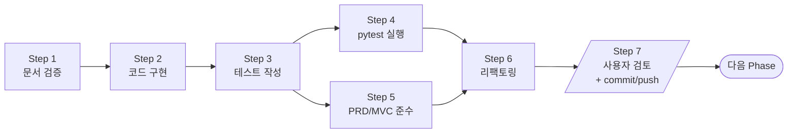

# CLAUDE.md

This file provides guidance to Claude Code (claude.ai/code) when working with code in this repository.

## 현재 작업: 1.2 반도체 시료 생산 주문 관리 시스템 (프로젝트 개발)

**목적**: PoC 단계(1.1.1~1.1.4)에서 검증한 MVC 구조, JSON 영속성, 모니터링을 통합한 완성형 콘솔 시스템.

Git 저장소: https://github.com/JongtaeBaek/SampleOrderSystem-JongtaeBaek-18028041.git

**참고 — PoC 저장소**
- 1.1.1 MVC 스켈레톤: https://github.com/JongtaeBaek/ConsoleMVC-JongtaeBaek-18028041.git
- 1.1.2 데이터 영속성: https://github.com/JongtaeBaek/DataPersistence-JongtaeBaek-18028041.git
- 1.1.3 데이터 모니터링: https://github.com/JongtaeBaek/DataMonitor-JongtaeBaek-18028041.git
- 1.1.4 더미 데이터 생성: https://github.com/JongtaeBaek/DummyDataGenerator-JongtaeBaek-18028041.git

## 개발 환경

- Python 3.14 (`.venv` 가상환경)
- 앱 의존성: 표준 라이브러리만 사용
- 개발 의존성: `pytest`, `pytest-cov`

```bash
.venv\Scripts\activate
pip install pytest pytest-cov

python main.py

# 테스트 실행 (커버리지 100% 강제 + HTML 리포트 자동 산출)
pytest
```

HTML 커버리지 리포트: `htmlcov/index.html` (`pytest.ini`의 `addopts`에 고정)

## 아키텍처

```
View → Controller → Repository → JSON 파일
                 ↘ Model
main.py: 시작 시 JSON 로드 → ProductionQueue 복원 → 메뉴 루프
```

```
SampleOrderSystem/
├── main.py
├── data/                    # JSON 파일 저장 위치 (git 제외)
│   ├── samples.json
│   └── orders.json
├── model/
│   ├── sample.py
│   ├── order.py             # Order + OrderStatus
│   └── production.py        # ProductionJob + ProductionQueue
├── repository/
│   ├── sample_repository.py
│   └── order_repository.py
├── view/
│   ├── menu_view.py
│   ├── sample_view.py
│   ├── order_view.py
│   └── monitoring_view.py
└── controller/
    ├── sample_controller.py
    ├── order_controller.py
    ├── monitoring_controller.py
    ├── production_controller.py
    └── release_controller.py
```

## 도메인 모델

**Sample**: `sample_id`, `name`, `avg_production_time`(시간), `yield_rate`(0.0~1.0), `stock`

**Order**: `order_id`(uuid4 앞 8자리), `sample_id`, `customer_name`, `quantity`, `status`(OrderStatus)

**OrderStatus**:
```
RESERVED → (재고충분) → CONFIRMED → RELEASE
         → (재고부족) → PRODUCING → CONFIRMED → RELEASE
         → REJECTED  (모니터링 제외)
```

**ProductionJob**: `order_id`, `sample_id`, `required_quantity`, `actual_production`, `total_time`

**생산량 공식**: `actual_production = ceil(required_quantity / (yield_rate × 0.9))`

**ProductionQueue**: FIFO, `collections.deque` 사용

## 핵심 비즈니스 로직

### 주문 승인 (`OrderController.approve`)
1. 대상 주문의 sample 조회
2. `stock >= quantity` → 즉시 `CONFIRMED`, `stock -= quantity`
3. `stock < quantity` → `shortage = quantity - stock`, `ProductionJob` 생성 후 큐에 enqueue, 상태 `PRODUCING`
4. samples + orders `save()`

### 생산 완료 (`ProductionController.complete`)
1. 큐에서 dequeue
2. `sample.stock += job.actual_production`
3. 해당 order 상태 `PRODUCING → CONFIRMED`
4. samples + orders `save()`

### 출고 처리 (`ReleaseController.release`)
1. CONFIRMED 상태 주문 선택
2. `sample.stock -= order.quantity`
3. 상태 `CONFIRMED → RELEASE`
4. samples + orders `save()`

### 앱 시작 시 ProductionQueue 복원 (`main.py: _restore_queue`)
- `PRODUCING` 상태 주문을 순회하여 ProductionJob을 재구성, 큐에 enqueue
- 별도 JSON 파일 없이 주문 상태만으로 복원

## JSON 직렬화 규칙

- `Sample` ↔ dict: `dataclasses.asdict()` 그대로
- `Order` ↔ dict: `status` 필드는 `OrderStatus.value`(문자열)로 저장, 로드 시 `OrderStatus(value)`로 복원
- 파일 없으면 빈 리스트 반환 (최초 실행 대응)

## 메인 메뉴 구조

| 선택 | 기능 | 서브메뉴 |
|------|------|---------|
| 1 | 시료 관리 | 등록 / 조회 / 검색 |
| 2 | 시료 주문 | 예약 |
| 3 | 주문 승인/거절 | 목록 / 승인 / 거절 |
| 4 | 모니터링 | 주문량 확인 / 재고량 확인 |
| 5 | 생산 라인 조회 | 생산 현황 / 대기 주문 |
| 6 | 출고 처리 | 목록 / 출고 |
| 0 | 종료 | |

## 개발 워크플로우 (Phase별 7-Step 사이클)

각 Phase는 아래 7단계로 진행한다. 상세 흐름도는 `PLAN.md > 진행 흐름도` 참조.



| Step | 명령 | 역할 | 완료 기준 |
|------|------|------|-----------|
| 1 | `/agents:subagent_doc_validator <phase>` | 문서 정합성 검증 | PASS 리포트 |
| 2 | `/agents:subagent_code_implementer <phase>` | 소스 코드 구현 | 파일 생성 완료 |
| 3 | `/agents:subagent_test_writer <phase>` | 테스트 코드 작성 | 테스트 파일 생성 완료 |
| 4 | `/agents:subagent_tester <phase>` | pytest 실행 검증 | 전체 PASS + 커버리지 100% |
| 5 | `/agents:subagent_compliance_verifier <phase>` | PRD/MVC 준수 검증 | PASS 리포트 |
| 6 | `/agents:subagent_refactorer <phase>` | 클린 코드 리팩토링 | 리팩토링 후 pytest PASS |
| 7 | 사용자 직접 검토 & `git commit/push` | Phase 완료 게이트 | 검토 승인 + push 완료 |

**Phase 격리 원칙**
- 반드시 현재 Phase의 7개 Step만 수행한다.
- Step 7(사용자 검토 & git commit/push)이 완료되기 전까지 다음 Phase를 시작하지 않는다.
- Step 4, Step 5는 병렬 실행 가능. 둘 다 PASS 후 Step 6 실행.

## 테스트 전략

- **목표**: 커버리지 100% (`# pragma: no cover` 사용 금지)
- **프레임워크**: `pytest` + `pytest-cov`
- **리포트**: `pytest` 실행 시 `htmlcov/index.html` 자동 생성 (`addopts` 고정)
- **Repository 테스트**: `tmp_path` fixture로 실제 파일 I/O 검증
- **Controller 테스트**: Repository를 mock하여 상태 변화 검증
- **View 테스트**: `builtins.input` mock, `capsys`로 출력 검증
- **main.py 테스트**: `tmp_path` + `monkeypatch.chdir`, `runpy`로 `__main__` 블록 커버
- `pytest.ini`: `pythonpath = .`, `testpaths = tests`
