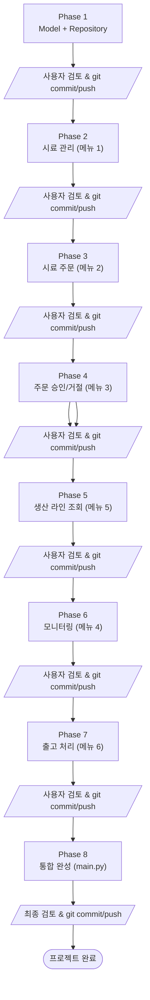
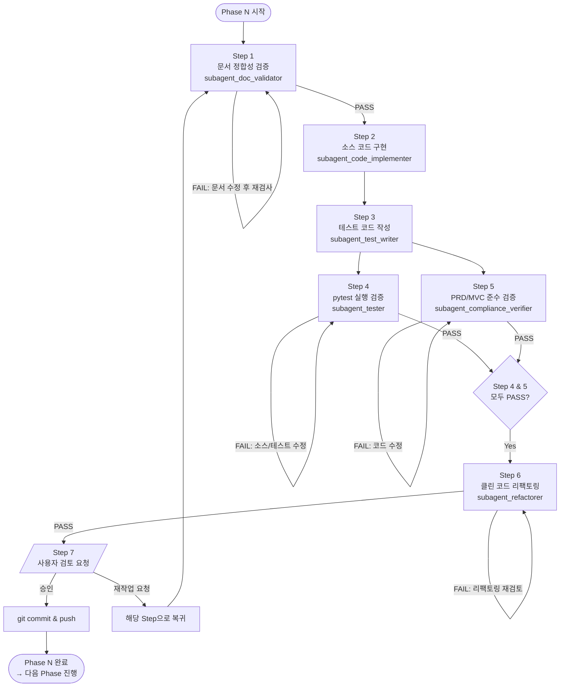

# PLAN.md — 개발 계획

## SubAgent 명령 참조

| 명령 | 파일 | 역할 |
|------|------|------|
| `/agents:subagent_doc_validator <phase>` | `.claude/agents/subagent_doc_validator.md` | 문서 정합성 검증 |
| `/agents:subagent_code_implementer <phase>` | `.claude/agents/subagent_code_implementer.md` | 소스 코드 구현 |
| `/agents:subagent_test_writer <phase>` | `.claude/agents/subagent_test_writer.md` | 테스트 코드 작성 |
| `/agents:subagent_tester <phase>` | `.claude/agents/subagent_tester.md` | pytest 실행 및 커버리지 검증 |
| `/agents:subagent_compliance_verifier <phase>` | `.claude/agents/subagent_compliance_verifier.md` | PRD/MVC 준수 검증 |
| `/agents:subagent_refactorer <phase>` | `.claude/agents/subagent_refactorer.md` | 클린 코드 리팩토링 |

Step 4, Step 5는 병렬 실행. 둘 다 PASS 후 Step 6 실행. Step 6 PASS 후 **사용자 검토 → git commit/push** 완료 시 Phase 완료.

## 개발 원칙

- 각 Phase는 독립적으로 테스트 가능한 단위로 구성
- Phase 완료 기준: 해당 Phase 범위 내 커버리지 100%
- 최종 완료 기준: 전체 커버리지 100% (`pytest` 단일 명령)
- **Phase 격리**: 반드시 현재 Phase의 7개 Step만 수행한다. 이전 Phase가 완전히 완료(✅)되지 않은 상태에서 다음 Phase를 시작하지 않는다.
- **Phase 완료 게이트**: Step 6 완료 후 반드시 사용자의 검토를 받는다. 사용자가 승인하면 `git commit & push`를 수행하고 다음 Phase로 진행한다. 재작업이 필요하면 해당 Step으로 돌아가 수정한다.

---

## 진행 흐름도

### 전체 Phase 진행 순서



> 각 Phase는 반드시 사용자 검토 & git commit/push 완료 후에만 다음 Phase로 진행한다.

### Phase 내 7-Step 사이클 (모든 Phase 공통)



> Step 4, Step 5는 병렬 실행. 둘 다 PASS 확인 후 Step 6 진입.  
> Step 7은 SubAgent가 아닌 **사용자 직접 검토** 단계. 승인 시에만 git commit/push 후 다음 Phase로 진행.

---

## Phase 1 — 기반 구성 (Model + Repository)

**설계 문서**: [`design/phase1.md`](design/phase1.md)

**목표**: 도메인 모델과 JSON 영속성 레이어 완성

**산출물**
- `model/sample.py` — Sample 데이터클래스
- `model/order.py` — Order 데이터클래스 + OrderStatus Enum
- `model/production.py` — ProductionJob 데이터클래스 + ProductionQueue
- `repository/sample_repository.py` — load / save
- `repository/order_repository.py` — load / save (OrderStatus 직렬화 포함)
- `pytest.ini`

**테스트 범위**
- `tests/test_model_sample.py`
- `tests/test_model_order.py`
- `tests/test_model_production.py`
- `tests/test_repository_sample.py` — `tmp_path` 기반 실제 파일 I/O
- `tests/test_repository_order.py` — OrderStatus 직렬화/역직렬화 검증

**완료 조건**: model + repository 커버리지 100%

**진행 Steps**

| Step | 명령 | 완료 기준 | 상태 |
|------|------|-----------|------|
| 1 | `/agents:subagent_doc_validator 1` | PASS 리포트 | ✅ |
| 2 | `/agents:subagent_code_implementer 1` | 산출물 파일 생성 완료 | ✅ |
| 3 | `/agents:subagent_test_writer 1` | 테스트 파일 생성 완료 | ✅ |
| 4 | `/agents:subagent_tester 1` | 전체 PASS + 커버리지 100% | ✅ |
| 5 | `/agents:subagent_compliance_verifier 1` | PASS 리포트 | ✅ |
| 6 | `/agents:subagent_refactorer 1` | 리팩토링 후 pytest PASS | ✅ |
| 7 | 사용자 검토 & `git commit/push` | 검토 승인 + push 완료 | ✅ |

> Step 4, Step 5 병렬 실행 가능. 둘 다 PASS 후 Step 6 실행.  
> **Step 7 완료 전까지 Phase 2를 시작하지 않는다.**

---

## Phase 2 — 시료 관리 (메뉴 1)

**설계 문서**: [`design/phase2.md`](design/phase2.md)

**목표**: 시료 등록 / 조회 / 검색 기능 완성

**산출물**
- `view/sample_view.py` — 입력 수집 + 목록/검색 결과 출력
- `controller/sample_controller.py`
  - `register(sample_id, name, avg_time, yield_rate)` — 중복 ID 검사 후 저장
  - `list_all()` — 전체 목록 반환
  - `search(keyword)` — 이름 부분 일치 검색
- `main.py` — 시료 관리 메뉴(1번)만 포함하는 실행 가능 파일
- `.coveragerc` — `[run] omit = main.py` (Phase 8 에서 제거)

**테스트 범위**
- `tests/test_view_sample.py` — input mock, capsys
- `tests/test_controller_sample.py` — SampleRepository mock

**완료 조건**: Phase 1 + Phase 2 커버리지 100%

**진행 Steps**

| Step | 명령 | 완료 기준 | 상태 |
|------|------|-----------|------|
| 1 | `/agents:subagent_doc_validator 2` | PASS 리포트 | ✅ |
| 2 | `/agents:subagent_code_implementer 2` | 산출물 파일 생성 완료 | ✅ |
| 3 | `/agents:subagent_test_writer 2` | 테스트 파일 생성 완료 | ✅ |
| 4 | `/agents:subagent_tester 2` | 전체 PASS + 커버리지 100% | ✅ |
| 5 | `/agents:subagent_compliance_verifier 2` | PASS 리포트 | ✅ |
| 6 | `/agents:subagent_refactorer 2` | 리팩토링 후 pytest PASS | ✅ |
| 7 | 사용자 검토 & `git commit/push` | 검토 승인 + push 완료 | ✅ |

> Step 4, Step 5 병렬 실행 가능. 둘 다 PASS 후 Step 6 실행.  
> **Step 7 완료 전까지 Phase 3을 시작하지 않는다.**

---

## Phase 3 — 시료 주문 (메뉴 2)

**설계 문서**: [`design/phase3.md`](design/phase3.md)

**목표**: 주문 예약 기능 완성

**산출물**
- `view/order_view.py` — 예약 입력 수집, 주문 목록 출력
- `controller/order_controller.py`
  - `reserve(sample_id, customer_name, quantity)` — sample 존재 검사, Order 생성(RESERVED), 저장
- `main.py` 업데이트 — 시료 주문 메뉴(2번) 추가, `OrderRepository` 분리 초기화

**테스트 범위**
- `tests/test_view_order.py` (예약 부분)
- `tests/test_controller_order.py` (reserve)

**완료 조건**: Phase 1~3 커버리지 100%

**진행 Steps**

| Step | 명령 | 완료 기준 | 상태 |
|------|------|-----------|------|
| 1 | `/agents:subagent_doc_validator 3` | PASS 리포트 | ✅ |
| 2 | `/agents:subagent_code_implementer 3` | 산출물 파일 생성 완료 | ✅ |
| 3 | `/agents:subagent_test_writer 3` | 테스트 파일 생성 완료 | ✅ |
| 4 | `/agents:subagent_tester 3` | 전체 PASS + 커버리지 100% | ✅ |
| 5 | `/agents:subagent_compliance_verifier 3` | PASS 리포트 | ✅ |
| 6 | `/agents:subagent_refactorer 3` | 리팩토링 후 pytest PASS | ✅ |
| 7 | 사용자 검토 & `git commit/push` | 검토 승인 + push 완료 | ✅ |

> Step 4, Step 5 병렬 실행 가능. 둘 다 PASS 후 Step 6 실행.  
> **Step 7 완료 전까지 Phase 4를 시작하지 않는다.**

---

## Phase 4 — 주문 승인/거절 (메뉴 3)

**설계 문서**: [`design/phase4.md`](design/phase4.md)

**목표**: 재고 분기 승인 로직 + 거절 기능 완성

**산출물**
- `controller/order_controller.py` 추가
  - `list_reserved()` — RESERVED 목록 반환
  - `approve(order_id, production_queue)` — 재고 분기 처리
    - 재고 충분: `CONFIRMED`, `stock -= quantity`
    - 재고 부족: `ProductionJob` 생성 + 큐 enqueue, `PRODUCING`
  - `reject(order_id)` — `REJECTED` 전환
- `view/order_view.py` 추가 — 승인/거절 입력 수집, RESERVED 목록 출력
- `main.py` 업데이트 — 주문 승인/거절 메뉴(3번) 추가, `ProductionQueue()` 생성

**테스트 범위**
- `tests/test_controller_order.py` (approve 재고 충분/부족 분기, reject)
- `tests/test_view_order.py` (승인/거절 화면)

**완료 조건**: Phase 1~4 커버리지 100%

**진행 Steps**

| Step | 명령 | 완료 기준 | 상태 |
|------|------|-----------|------|
| 1 | `/agents:subagent_doc_validator 4` | PASS 리포트 | ✅ |
| 2 | `/agents:subagent_code_implementer 4` | 산출물 파일 생성 완료 | ✅ |
| 3 | `/agents:subagent_test_writer 4` | 테스트 파일 생성 완료 | ✅ |
| 4 | `/agents:subagent_tester 4` | 전체 PASS + 커버리지 100% | ✅ |
| 5 | `/agents:subagent_compliance_verifier 4` | PASS 리포트 | ✅ |
| 6 | `/agents:subagent_refactorer 4` | 리팩토링 후 pytest PASS | ✅ |
| 7 | 사용자 검토 & `git commit/push` | 검토 승인 + push 완료 | ✅ |

> Step 4, Step 5 병렬 실행 가능. 둘 다 PASS 후 Step 6 실행.  
> **Step 7 완료 전까지 Phase 5를 시작하지 않는다.**

---

## Phase 5 — 생산 라인 조회 (메뉴 5)

**설계 문서**: [`design/phase5.md`](design/phase5.md)

**목표**: 생산 현황 표시 + 생산 완료 처리 기능 완성

**산출물**
- `controller/production_controller.py`
  - `show_current(production_queue)` — 큐 peek 결과 반환
  - `complete(production_queue)` — dequeue, stock 증가, 주문 CONFIRMED, 저장
  - `list_queue(production_queue)` — 대기 목록 반환
- `view/monitoring_view.py` (생산 현황 / 대기 목록 출력 부분)
- `main.py` 업데이트 — 생산 라인 조회 메뉴(5번) 추가

**테스트 범위**
- `tests/test_controller_production.py` — 큐 비어있는 경우 / 완료 처리 분기
- `tests/test_view_monitoring.py` (생산 현황 부분)

**완료 조건**: Phase 1~5 커버리지 100%

**진행 Steps**

| Step | 명령 | 완료 기준 | 상태 |
|------|------|-----------|------|
| 1 | `/agents:subagent_doc_validator 5` | PASS 리포트 | ✅ |
| 2 | `/agents:subagent_code_implementer 5` | 산출물 파일 생성 완료 | ✅ |
| 3 | `/agents:subagent_test_writer 5` | 테스트 파일 생성 완료 | ✅ |
| 4 | `/agents:subagent_tester 5` | 전체 PASS + 커버리지 100% | ✅ |
| 5 | `/agents:subagent_compliance_verifier 5` | PASS 리포트 | ✅ |
| 6 | `/agents:subagent_refactorer 5` | 리팩토링 후 pytest PASS | ✅ |
| 7 | 사용자 검토 & `git commit/push` | 검토 승인 + push 완료 | ✅ |

> Step 4, Step 5 병렬 실행 가능. 둘 다 PASS 후 Step 6 실행.  
> **Step 7 완료 전까지 Phase 6을 시작하지 않는다.**

---

## Phase 6 — 모니터링 (메뉴 4)

**설계 문서**: [`design/phase6.md`](design/phase6.md)

**목표**: 주문량 현황 + 재고 상태 조회 기능 완성

**산출물**
- `controller/monitoring_controller.py`
  - `order_summary()` — 상태별 주문 건수 반환 (REJECTED 제외)
  - `stock_summary()` — 시료별 재고 + 여유/부족/고갈 상태 반환
- `view/monitoring_view.py` 추가 — 주문량 / 재고량 출력
- `main.py` 업데이트 — 모니터링 메뉴(4번) 추가

**재고 상태 기준**
- 고갈: `stock == 0`
- 부족: `stock > 0` and `stock < sum(RESERVED + PRODUCING 주문량)`
- 여유: 그 외

**테스트 범위**
- `tests/test_controller_monitoring.py`
- `tests/test_view_monitoring.py` (모니터링 화면 부분)

**완료 조건**: Phase 1~6 커버리지 100%

**진행 Steps**

| Step | 명령 | 완료 기준 | 상태 |
|------|------|-----------|------|
| 1 | `/agents:subagent_doc_validator 6` | PASS 리포트 | ✅ |
| 2 | `/agents:subagent_code_implementer 6` | 산출물 파일 생성 완료 | ✅ |
| 3 | `/agents:subagent_test_writer 6` | 테스트 파일 생성 완료 | ✅ |
| 4 | `/agents:subagent_tester 6` | 전체 PASS + 커버리지 100% | ✅ |
| 5 | `/agents:subagent_compliance_verifier 6` | PASS 리포트 | ✅ |
| 6 | `/agents:subagent_refactorer 6` | 리팩토링 후 pytest PASS | ✅ |
| 7 | 사용자 검토 & `git commit/push` | 검토 승인 + push 완료 | ✅ |

> Step 4, Step 5 병렬 실행 가능. 둘 다 PASS 후 Step 6 실행.  
> **Step 7 완료 전까지 Phase 7을 시작하지 않는다.**

---

## Phase 7 — 출고 처리 (메뉴 6)

**설계 문서**: [`design/phase7.md`](design/phase7.md)

**목표**: CONFIRMED 주문 출고 기능 완성

**산출물**
- `controller/release_controller.py`
  - `list_confirmed()` — CONFIRMED 목록 반환
  - `release(order_id)` — `stock -= quantity`, 상태 RELEASE, 저장
- `main.py` 업데이트 — 출고 처리 메뉴(6번) 추가 (메뉴 1~6 전체 완성)

**테스트 범위**
- `tests/test_controller_release.py`

**완료 조건**: Phase 1~7 커버리지 100%

**진행 Steps**

| Step | 명령 | 완료 기준 | 상태 |
|------|------|-----------|------|
| 1 | `/agents:subagent_doc_validator 7` | PASS 리포트 | ✅ |
| 2 | `/agents:subagent_code_implementer 7` | 산출물 파일 생성 완료 | ✅ |
| 3 | `/agents:subagent_test_writer 7` | 테스트 파일 생성 완료 | ✅ |
| 4 | `/agents:subagent_tester 7` | 전체 PASS + 커버리지 100% | ✅ |
| 5 | `/agents:subagent_compliance_verifier 7` | PASS 리포트 | ✅ |
| 6 | `/agents:subagent_refactorer 7` | 리팩토링 후 pytest PASS | ✅ |
| 7 | 사용자 검토 & `git commit/push` | 검토 승인 + push 완료 | ✅ |

> Step 4, Step 5 병렬 실행 가능. 둘 다 PASS 후 Step 6 실행.  
> **Step 7 완료 전까지 Phase 8을 시작하지 않는다.**

---

## Phase 8 — 통합 완성 (main.py + View 완성)

**설계 문서**: [`design/phase8.md`](design/phase8.md)

**목표**: 전체 메뉴 루프 통합, ProductionQueue 복원, 최종 커버리지 100%

**산출물**
- `view/menu_view.py` — 메인/서브 메뉴 출력 + 선택 입력
- `main.py` 리팩토링
  - `_restore_queue(orders, samples)` — PRODUCING 주문으로 ProductionQueue 재구성
  - `main()` — MenuView 적용, 앱 시작 시 JSON 로드 + 큐 복원, 메뉴 1~6 라우팅
  - 기존 `_handle_*` 핸들러를 `menu_view` 인자를 받는 형태로 교체
- `.coveragerc` 업데이트 — `omit = main.py` 제거
- `tests/test_main.py` — `runpy` 기반 통합 테스트, `__main__` 블록 커버

**ProductionQueue 복원 로직**
```
for order in orders where status == PRODUCING:
    sample = find sample by order.sample_id
    shortage = order.quantity - sample.stock  (단, shortage > 0 보장)
    actual = ceil(shortage / (yield_rate × 0.9))
    queue.enqueue(ProductionJob(...))
```

**테스트 범위**
- `tests/test_view_menu.py`
- `tests/test_main.py` — `monkeypatch.chdir(tmp_path)`, `runpy` 로 `__main__` 블록 커버
  - 메뉴 0~6 모든 분기 `side_effect` 리스트로 순서 제어

**완료 조건**: 전체 커버리지 100%, `pytest` 단일 명령으로 통과

**진행 Steps**

| Step | 명령 | 완료 기준 | 상태 |
|------|------|-----------|------|
| 1 | `/agents:subagent_doc_validator 8` | PASS 리포트 | ✅ |
| 2 | `/agents:subagent_code_implementer 8` | 산출물 파일 생성 완료 | ✅ |
| 3 | `/agents:subagent_test_writer 8` | 테스트 파일 생성 완료 | ✅ |
| 4 | `/agents:subagent_tester 8` | 전체 PASS + 커버리지 100% | ✅ |
| 5 | `/agents:subagent_compliance_verifier 8` | PASS 리포트 | ✅ |
| 6 | `/agents:subagent_refactorer 8` | 리팩토링 후 pytest PASS | ✅ |
| 7 | 사용자 검토 & `git commit/push` | 검토 승인 + push 완료 | ⬜ |

> Step 4, Step 5 병렬 실행 가능. 둘 다 PASS 후 Step 6 실행.  
> **Step 7 완료 후 프로젝트 최종 완료.**

---

## Phase 진행 상태

| Phase | 내용 | Step1 문서검증 | Step2 코드구현 | Step3 테스트작성 | Step4 테스트실행 | Step5 PRD준수 | Step6 리팩토링 | Step7 검토/push | Phase 상태 |
|-------|------|:--------------:|:--------------:|:----------------:|:----------------:|:-------------:|:--------------:|:---------------:|:----------:|
| 1 | Model + Repository | ✅ | ✅ | ✅ | ✅ | ✅ | ✅ | ✅ | ✅ 완료 |
| 2 | 시료 관리 (메뉴 1) | ✅ | ✅ | ✅ | ✅ | ✅ | ✅ | ✅ | ✅ 완료 |
| 3 | 시료 주문 (메뉴 2) | ✅ | ✅ | ✅ | ✅ | ✅ | ✅ | ✅ | ✅ 완료 |
| 4 | 주문 승인/거절 (메뉴 3) | ✅ | ✅ | ✅ | ✅ | ✅ | ✅ | ✅ | ✅ 완료 |
| 5 | 생산 라인 조회 (메뉴 5) | ⬜ | ⬜ | ⬜ | ⬜ | ⬜ | ⬜ | ⬜ | ⬜ 대기 |
| 6 | 모니터링 (메뉴 4) | ⬜ | ⬜ | ⬜ | ⬜ | ⬜ | ⬜ | ⬜ | ⬜ 대기 |
| 7 | 출고 처리 (메뉴 6) | ⬜ | ⬜ | ⬜ | ⬜ | ⬜ | ⬜ | ⬜ | ⬜ 대기 |
| 8 | 통합 완성 (main.py) | ⬜ | ⬜ | ⬜ | ⬜ | ⬜ | ⬜ | ⬜ | ⬜ 대기 |
